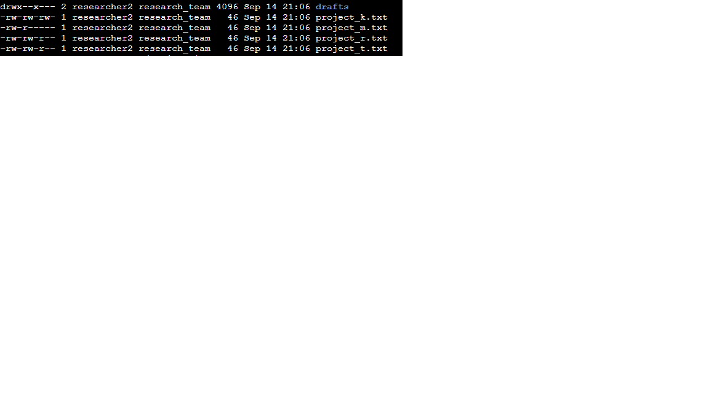
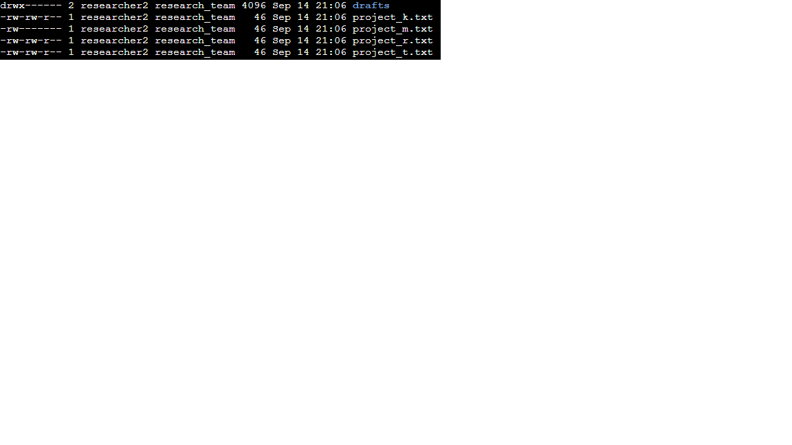

# File permissions in Linux

## Project description

In this project, I used Linux commands to inspect and manage file and directory permissions. I identified incorrect permissions and modified them to ensure that only authorized users have access to the required resources.

## Check file and directory details

First, I navigated to the `projects` directory and obtained a list of its contents and permissions.

Commands used:

```bash
cd /home/researcher2/projects
ls -l
```

The `ls -l` command displayed the files, directories, ownership, and permissions.

Next, I identified hidden files in the `projects` directory.

Command used:

```bash
ls -a
```

I then used `ls -la` to display both regular and hidden files together with their permissions.

## Describe the permissions string

Linux permissions are represented by a 10-character string.

For example:

```text
drwx--x---
```

The first character represents the file type. In this case, `d` indicates that the item is a directory.

The remaining nine characters are divided into three groups of three:

```text
d | rwx | --x | ---
    owner  group  others
```

The first group represents the permissions of the file owner, the second represents the permissions of the group, and the third represents the permissions of others.

The three permission types are:

* `r` — read
* `w` — write
* `x` — execute

For the `drafts` directory, the owner had read, write, and execute permissions, while the group had execute permission and others had no permissions.

## Change file permissions

I inspected the permissions of the files in the `projects` directory to identify permissions that did not match the required authorization.

The file `project_k.txt` initially had the following permissions:

```text
-rw-rw-rw-
```

The `others` category had write permission, which was not authorized.

I removed the write permission from others using:

```bash
chmod o-w project_k.txt
```

The resulting permissions were:

```text
-rw-rw-r--
```

The file `project_m.txt` initially had the following permissions:

```text
-rw-r-----
```

The group had read permission even though the group should not have any permissions on this file.

I removed the group's read permission using:

```bash
chmod g-r project_m.txt
```

The resulting permissions were:

```text
-rw-------
```

## Change file permissions on a hidden file

I also inspected the hidden files in the directory using:

```bash
ls -la
```

The hidden file `.project_x.txt` initially had the following permissions:

```text
-rw--w----
```

The owner had write permission and the group also had write permission. Neither write permission was authorized.

I used the following command to remove both write permissions and add read permission for the group:

```bash
chmod u-w,g-w,g+r .project_x.txt
```

The resulting permissions were:

```text
-r--r-----
```

## Change directory permissions

Finally, I examined the permissions of the `drafts` directory.

The initial permissions were:

```text
drwx--x---
```

The owner had full permissions, while the group had execute permission. The required authorization was that only `researcher2` should have access to the directory and its contents.

I removed the group's execute permission using:

```bash
chmod g-x drafts
```

The resulting permissions were:

```text
drwx------
```

This removed the group's access while preserving full permissions for the owner.

## Summary

This project helped me practice auditing and modifying Linux file and directory permissions using the command line. I learned how to interpret permission strings, identify unauthorized access, use `chmod` to modify permissions, and verify the changes with `ls -l` and `ls -la`.

These skills are relevant to cybersecurity because incorrect file permissions can allow unauthorized users to access or modify sensitive information. Applying the principle of least privilege helps reduce the risk of unauthorized access.
## Evidence

### Permissions before remediation



### Permissions after remediation


