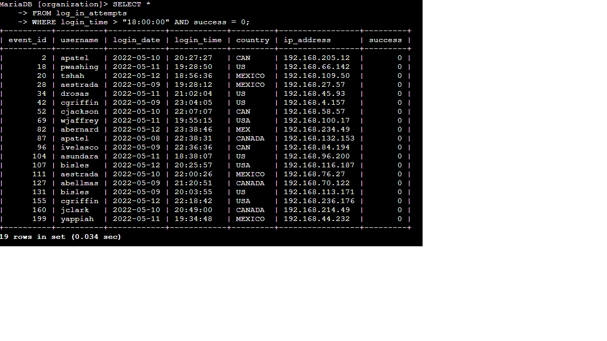
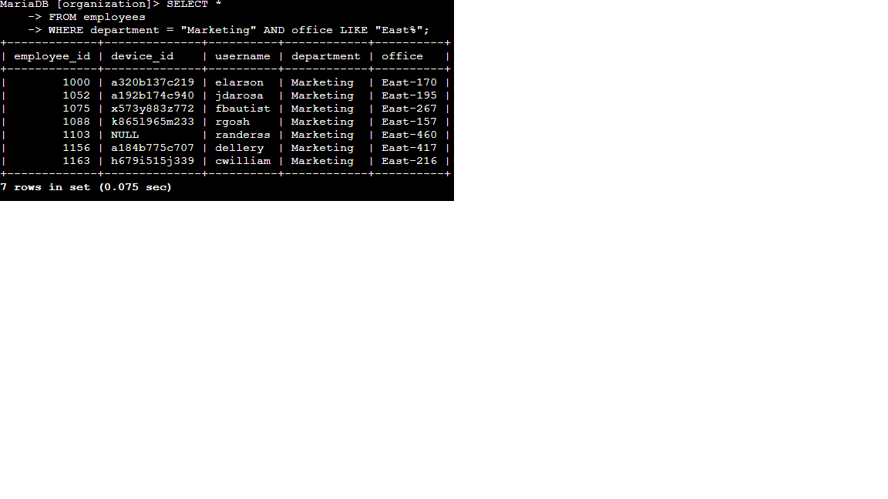

# Apply filters to SQL queries

## Project description

In this project, I used SQL queries to filter and retrieve specific information about employees, their machines, login attempts, and the departments they belong to.

The goal was to practice using SQL to investigate security-related data and retrieve only the records relevant to a specific investigation.

## Retrieve after-hours failed login attempts

I needed to identify unsuccessful login attempts that occurred after 18:00.

The query was:

```sql
SELECT *
FROM log_in_attempts
WHERE login_time > '18:00:00' AND success = 0;
```

This query filters for failed login attempts that occurred after business hours, which can help identify potentially suspicious authentication activity.

## Retrieve login attempts on specific dates

I needed to retrieve all login attempts that occurred on May 8, 2022, or May 9, 2022.

The query was:

```sql
SELECT *
FROM log_in_attempts
WHERE login_date = '2022-05-08' OR login_date = '2022-05-09';
```

This allows security analysts to focus their investigation on authentication activity from specific dates.

## Retrieve login attempts outside of Mexico

I needed to investigate login attempts that did not originate in Mexico.

The query was:

```sql
SELECT *
FROM log_in_attempts
WHERE NOT country LIKE 'MEX%';
```

The `LIKE` operator allows the query to match country values beginning with `MEX`, while `NOT` excludes those records from the results.

## Retrieve employees in Marketing

I needed to obtain information about employees in the Marketing department who were located in the East building.

The query was:

```sql
SELECT *
FROM employees
WHERE department = 'Marketing' AND office LIKE 'East%';
```

This query demonstrates how multiple conditions can be combined to retrieve a specific group of employees.

## Retrieve employees in Finance or Sales

I needed to find information about all employees in either the Finance or Sales department.

The query was:

```sql
SELECT *
FROM employees
WHERE department = 'Sales' OR department = 'Finance';
```

The `OR` operator allows the query to return employees who belong to either department.

## Retrieve all employees not in IT

I needed to find records for employees who were not in the Information Technology department.

The query was:

```sql
SELECT *
FROM employees
WHERE department != 'Information Technology';
```

This query demonstrates how the `!=` operator can be used to exclude records matching a specific condition.

## Summary

This project helped me practice using SQL to filter and retrieve specific information from security-related databases. I used `WHERE`, `AND`, `OR`, `NOT`, `LIKE`, and comparison operators to investigate login attempts and retrieve employee information based on different criteria.

These skills are relevant to cybersecurity because SQL can be used to investigate authentication activity, identify potentially suspicious login attempts, and retrieve information needed during security investigations. This project also helped me understand how precise filtering can make large datasets easier to analyze and support security-related decision-making.

## Evidence

### After-hours failed login investigation



### Employee data filtering


